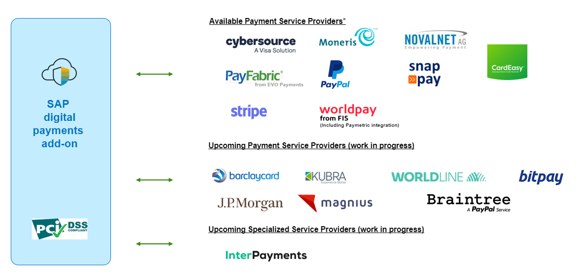
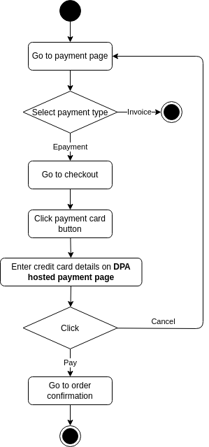

= SAP Digital Payment Addon Integration POC
:toc:

== Overview
Project to explore the integration of an ecommerce shop with sap digital payments addon. SAP DPA eases integration of payment with S/4Hana and other systems, having to integrate only one API for all payment providers.

Consists of a vue xref:frontend/README.adoc[**frontend**], making calls to a node xref:backend/README.adoc[**backend**].

[source,mermaid]
----
sequenceDiagram
box Proof of concept
participant vue frontend
participant node backend
end

vue frontend ->> node backend: Call e.g. getLib
node backend ->> SAP Digital Payment Addon: /v1/dpjslib/loader
SAP Digital Payment Addon -->> node backend: return 
node backend -->> vue frontend: return
vue frontend ->> SAP Digital Payment Addon: DPJSLIB directly communicates with DPA
SAP Digital Payment Addon -->> vue frontend: return
----

Some calls can only be done from a backend (e.g. getLib). Doing them in the browser will result in cors violation.

=== User Flow

=== Error Handling

==== Invalid Data

Invalid cards are declined directly by the sap dp payment card ui.

=== API Documentation
Since SAP did not yet publish the API documentation, this project includes xref:sapdp_api_doc/README.adoc[**an easy way**]  to view documentation given to us by Patrick Hamp.

=== SAP Commerce Cloud Integration
SAP integrated the Digital Payments Addon also into commerce cloud. That integration is not documented and I did not get it working.
Sap commerce cloud tries to access

POST https://digitalpayments-demo-core.cfapps.eu10.hana.ondemand.com/core/v1/cards/getregistrationurl

== Detailed Integration Sequence
The POC has only one Page. The integration sequence diagram is a template for integration into real world applications.

[source, mermaid]
----
sequenceDiagram
autonumber

actor User
participant Browser
participant Shop Frontend
participant DPJSLIB
participant Shop Backend
participant SAP DP
participant Payment Service Provider

User ->> Browser: Visit payment selection page, select epayment
Browser ->> Shop Frontend: forward
Shop Frontend ->> Shop Frontend: Store payment selection

User ->> Browser: Go to checkout overview
Browser ->> Shop Frontend: forward
Shop Frontend ->> Shop Backend: Get DPJSLIB Config
Shop Backend -->> Shop Frontend: return

Shop Frontend ->> Shop Frontend: load & init DPJSLIB

Shop Frontend ->> Shop Backend: get DigitalPaymentTransactionId
Shop Backend ->> SAP DPA: init payment session
SAP DPA -->> Shop Backend: return DigitalPaymentTransactionId
Shop Backend -->> Shop Frontend: return PaymentTransactionId
Shop Frontend ->> DPJSLIB: loadPaymentTypes(PaymentPageConfigurationId,\n    DigitalPaymentTransactionId)
DPJSLIB ->> SAP DPA: loadPaymentTypes
note over SAP DPA: Type: PC Name: Credit Card
SAP DPA -->> DPJSLIB: return paymentTypes
DPJSLIB -->> Shop Frontend: return paymentTypes
Shop Frontend ->> DPJSLIB: select card payment via selectPaymentType
DPJSLIB -->> Browser: render pay button for type

User ->> Browser: Click pay button
Browser ->> DPJSLIB: forward
DPJSLIB ->> SAP DPA: Communicate Users choice
SAP DPA -->> DPJSLIB: Return card details url
DPJSLIB -->> Browser: Open card details url in new window

User ->> Browser: Fill in payment details \n and click "Pay" on payment window
Browser ->> Payment Service Provider: send payment details
Payment Service Provider ->> Payment Service Provider: verify payment details
Payment Service Provider ->> Payment Service Provider: authorize payment
Payment Service Provider ->> DPJSLIB: return authorisation result
DPJSLIB ->> Browser: Close payment window. Render error message in error case, or nothing on success
DPJSLIB -->> Shop Frontend: return result
Shop Frontend -->> Browser: render success or error case
Shop Frontend ->> Shop Backend: send payment result (TransactionByOaytSrvcPrvdr)
Shop Backend ->> SAP DPA: finalize payment session
SAP DPA -->> Shop Backend: return finalize result
Shop Backend -->> Shop Frontend: return finalize result
----

== Architecture Decisions
. Vue was chosen for frontend, because it provides easy & fast development for the poc and is close enough to angular used by the project.
. Node.js was chosen for backend to have the same language for frontend & backend.
